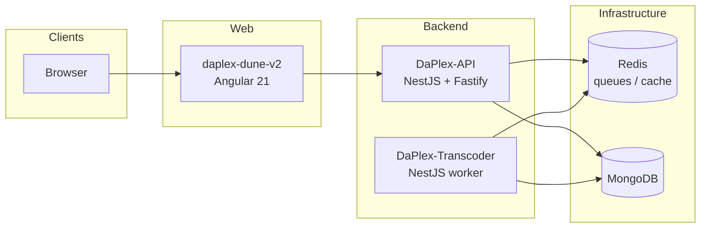

# DaPlex

**DaPlex** is a multi-service workspace for an **on-demand movie and TV streaming platform**: an Angular web app, a NestJS API, a dedicated transcoding worker, and a local **Redis** runtime for queues and cache.

This document is the **umbrella guide** for the repository layout, how the pieces connect, and how to run everything locally.

---

## Table of contents

1. [Sub-repositories (map & addresses)](#sub-repositories-map--addresses)
2. [Architecture](#architecture)
3. [Technology stack](#technology-stack)
4. [Prerequisites](#prerequisites)
5. [Local development (startup order)](#local-development-startup-order)
6. [Build & test](#build--test)
7. [Ports and defaults](#ports-and-defaults)
8. [Environment configuration](#environment-configuration)
9. [Submodule workflow](#submodule-workflow)
10. [Project-level documentation](#project-level-documentation)
11. [Other folders in this workspace](#other-folders-in-this-workspace)
12. [Troubleshooting](#troubleshooting)
13. [Contributing](#contributing)

---

## Sub-repositories (map & addresses)

The production system is composed of **four first-class components**. In this monorepo they live as **sibling directories** under the workspace root, wired in as git submodules.

| Component | Local path | Role |
|-----------|------------|------|
| **Web client** | [`daplex-dune-v2/`](./daplex-dune-v2/) | Angular 21 SPA: browsing, playback UI, auth flows, i18n (Transloco). |
| **API** | [`DaPlex-API/`](./DaPlex-API/) | NestJS (Fastify): REST API, WebSockets, auth, media catalog, BullMQ producers, Swagger in dev. |
| **Transcoder** | [`DaPlex-Transcoder/`](./DaPlex-Transcoder/) | NestJS (Fastify) worker: BullMQ consumer, FFmpeg/MediaInfo/MP4Box media pipeline, rclone storage. |
| **Redis** | [`Redis/`](./Redis/) | Local Redis config + Windows launcher for development (not a Node package). |

### GitHub repositories

This root folder is the **umbrella** repo; application code lives in **git submodules** (see [`.gitmodules`](./.gitmodules)).

| Component | Repository |
|-----------|-------------|
| **Umbrella** (this README + layout) | [github.com/yacucdeptrai/DaPlex](https://github.com/yacucdeptrai/DaPlex) |
| **Web** | [github.com/yacucdeptrai/daplex-dune-v2](https://github.com/yacucdeptrai/daplex-dune-v2) |
| **API** | [github.com/yacucdeptrai/DaPlex-API](https://github.com/yacucdeptrai/DaPlex-API) |
| **Transcoder** | [github.com/yacucdeptrai/DaPlex-Transcoder](https://github.com/yacucdeptrai/DaPlex-Transcoder) |
| **Redis** (configs only; `.exe`/`.dll` gitignored) | [github.com/yacucdeptrai/DaPlex-Redis](https://github.com/yacucdeptrai/DaPlex-Redis) |

**Clone everything (with submodules):**

```bash
git clone --recursive https://github.com/yacucdeptrai/DaPlex.git
cd DaPlex
```

If you already cloned without `--recursive`:

```bash
git submodule update --init --recursive
```

**Redis on a fresh clone:** the submodule ships **config and docs** only. On Windows, copy `redis-server.exe`, `redis-cli.exe`, and the required `.dll` files into `Redis/` from an official Windows build; on Linux/WSL, use your distro's `redis-server`. See [`Redis/README.md`](./Redis/README.md).

---

## Architecture

High-level request flow:



1. Users open the **Angular** app.
2. The app calls **DaPlex-API** for authentication, catalog, and streaming-related APIs (REST + WebSocket).
3. The API uses **MongoDB** (Mongoose) and **Redis** (cache, Socket.IO adapter, BullMQ producer).
4. **DaPlex-Transcoder** consumes BullMQ jobs from the **same Redis**, runs the FFmpeg-based media pipeline, and reads/writes the **same MongoDB**.

---

## Technology stack

| Layer | Technologies |
|-------|----------------|
| Frontend | Angular 21 (standalone, signals), RxJS, `@ngrx/signals`, Tailwind CSS, `@jsverse/transloco` (i18n), PrimeNG, Vidstack + dash.js + JASSUB (playback/subtitles); Karma/Jasmine + Playwright (tests) |
| API | NestJS 10, Fastify, Mongoose 7 (MongoDB), BullMQ + ioredis, Socket.IO, JWT + bcrypt, Swagger (dev), sharp; storage: Azure Blob / Cloudflare R2 / OneDrive / ImageKit; Jest |
| Transcoder | NestJS 10, Fastify, BullMQ consumer, Mongoose 7, external FFmpeg / MediaInfo / MP4Box (GPAC) / rclone, Winston; Jest |
| Infra (local) | Redis (default `6379`), MongoDB (default `27017`) |

---

## Prerequisites

| Requirement | Notes |
|-------------|--------|
| **Node.js** | **20+**. The workspace runs **Node 24**; the API's `mmmagic` override exists so its native addon builds on Node 24. |
| **npm** | 10.x or compatible. |
| **MongoDB** | Required by API and Transcoder (connection strings via env; Atlas or local). |
| **Redis** | 6+; required before API and Transcoder (cache + BullMQ). Use [`Redis/`](./Redis/) or any Redis instance. |
| **Media tools** (Transcoder only) | **FFmpeg**, **MediaInfo**, **MP4Box (GPAC)**, **rclone** — installed on the host and pointed at via the Transcoder's env (`FFMPEG_DIR`, `MEDIAINFO_DIR`, `MP4BOX_DIR`, `RCLONE_DIR`). |

> Dependencies are installed **inside each project folder** — there is no single root `package.json` for the whole stack.

---

## Local development (startup order)

### 1. Redis

```powershell
# Windows (from the Redis folder, binaries supplied)
cd Redis
.\start.bat            # or: .\redis-server.exe redis.conf
```

```bash
# Linux / WSL
cd Redis
redis-server ./redis.conf
```

Verify with `redis-cli -h 127.0.0.1 -p 6379 ping` → `PONG`. See [`Redis/README.md`](./Redis/README.md).

### 2. DaPlex-API

```bash
cd DaPlex-API
npm install
cp .env.example .env        # then fill in DB / Redis / JWT / CORS / storage
npm run start:dev
```

Set `PORT=3000` (matches the web client's default `apiUrl`). With `NODE_ENV=development`, Swagger UI is at `/docs`. See [`DaPlex-API/README.md`](./DaPlex-API/README.md).

### 3. DaPlex-Transcoder

```bash
cd DaPlex-Transcoder
npm install
# create .env: DATABASE_URL + REDIS_QUEUE_URL must match the API; set tool paths
npm run start:dev
```

Listens on `0.0.0.0:3001` by default. See [`DaPlex-Transcoder/README.md`](./DaPlex-Transcoder/README.md).

### 4. daplex-dune-v2 (Angular)

```bash
cd daplex-dune-v2
npm install --legacy-peer-deps
npm run start               # http://localhost:4200
```

API endpoints are set in `src/environments/environment.ts` (`apiUrl` → `http://localhost:3000/api`). See [`daplex-dune-v2/README.md`](./daplex-dune-v2/README.md).

---

## Build & test

Production builds:

```bash
# API / Transcoder
npm run build && npm run start:prod    # nest build -> dist/, then node dist/main

# Web
npm run build                          # ng build -> dist/daplex-v2
```

Tests (run inside each project folder):

| Service | Command | Notes |
|---------|---------|-------|
| **DaPlex-API** | `npx jest` &nbsp;/&nbsp; `npm run test:cov` | No bare `test` script. Native deps are mocked, so no DB/native build needed. |
| **DaPlex-Transcoder** | `npx jest` &nbsp;/&nbsp; `npm run test:cov` | No bare `test` script. Do **not** run `jest -u` on Linux/WSL — FFmpeg-arg snapshots are platform-normalized. |
| **daplex-dune-v2** | `npm test -- --watch=false --browsers=ChromeHeadlessCI` | Bare `ng test` is **watch mode** and never exits. E2E: `npm run e2e` (Playwright). |

---

## Ports and defaults

| Service | Default | Notes |
|---------|---------|--------|
| Angular dev server | **4200** | `ng serve` |
| DaPlex-API | **3000** (dev) | From env `PORT`; the web client's `apiUrl` expects 3000 |
| DaPlex-Transcoder | **3001** | `src/config.ts` default; override with `PORT` / `ADDRESS` |
| Redis | **6379** | Match the `REDIS_*` URLs in the service env files |
| MongoDB | **27017** | Default driver port |

---

## Environment configuration

- **DaPlex-API** — copy `.env.example` to `.env`. Covers server, MongoDB (+ WARP SOCKS5 fallback), the four `REDIS_*` URLs, JWT/cookie/crypto secrets, CORS, email, and storage providers.
- **DaPlex-Transcoder** — create a `.env`; `DATABASE_URL` and `REDIS_QUEUE_URL` must match the API, plus `CRYPTO_SECRET_KEY` (matches the API), tool paths, and encoding params.
- **daplex-dune-v2** — API base/socket URLs in `src/environments/environment*.ts`; e2e settings in `e2e/.env`.

Never commit real secrets.

---

## Submodule workflow

The umbrella repo **tracks pinned commits** for each submodule. After changing code inside a submodule, **commit and push inside that repo first**, then in the **umbrella** repo:

```bash
cd DaPlex
git add daplex-dune-v2        # or DaPlex-API, DaPlex-Transcoder, Redis
git commit -m "Bump submodule(s)"
git push
```

To pull the latest tracked branches into the submodules: `git submodule update --remote --merge`.

---

## Project-level documentation

| Path | Content |
|------|---------|
| [`daplex-dune-v2/README.md`](./daplex-dune-v2/README.md) | Web client: stack, install, serve, test, build. |
| [`DaPlex-API/README.md`](./DaPlex-API/README.md) | API: stack, env, start, test, build. |
| [`DaPlex-Transcoder/README.md`](./DaPlex-Transcoder/README.md) | Transcoder: prereqs, env, start, test, build. |
| [`Redis/README.md`](./Redis/README.md) | Local Redis: how to start the server. |
| [`REFACTORING_PLAN.md`](./REFACTORING_PLAN.md) | Codebase cleanup roadmap. |

---

## Other folders in this workspace

Only **daplex-dune-v2**, **DaPlex-API**, **DaPlex-Transcoder**, and **Redis** are part of the **default DaPlex runtime**. The root also contains auxiliary, non-runtime items:

- **`bao-cao-do-an/`** — academic project-report (thesis) sources and build scripts.
- Root docs/scripts — `REFACTORING_PLAN.md`, `SEO_PLAN.md`, `NEW_PC_SETUP.md`, and `sync-to-win.sh` (mirrors the native WSL workspace back to the Windows drive).

---

## Troubleshooting

| Symptom | What to check |
|---------|----------------|
| API or transcoder fails on startup | Redis up? MongoDB reachable? Env vars set? |
| CORS errors from Angular | `ORIGIN_URL` includes `http://localhost:4200`. |
| Jobs never process | Transcoder running? `DATABASE_URL` + `REDIS_QUEUE_URL` match the API? |
| `npm test` hangs (web) | Bare `ng test` is watch mode — add `--watch=false --browsers=ChromeHeadlessCI`. |
| Native module build fails (API) | Use Node 24; the `mmmagic` override is required. |
| Angular install peer conflicts | Install with `--legacy-peer-deps`. |
| Port already in use | Stop old Node processes or change `PORT`. |

---

## Contributing

1. Make changes in the **relevant subfolder** and keep commits scoped.
2. Run that project's **lint/tests** before opening a PR.
3. Update the **subproject README** when setup or behavior changes.
4. Keep this root **README** in sync when you add services or change default ports/flows.

---

## License

Subprojects declare their own licenses (`UNLICENSED` in published `package.json` files is common for private work). Confirm per-repo before redistribution.
