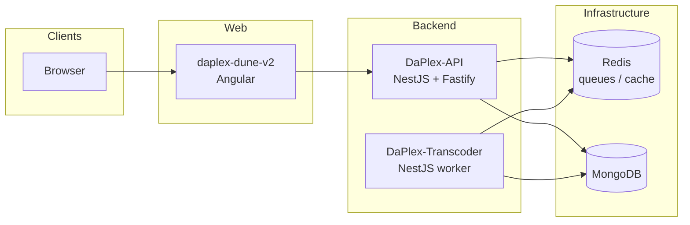

# DaPlex

**DaPlex** is a multi-service workspace for an **on-demand movie and TV streaming platform**: an Angular web app, a NestJS API, a dedicated transcoding worker, and a local **Redis** runtime for queues and cache.

This document is the **umbrella guide** for the repository layout, how the pieces connect, and how to run everything locally.

---

## Table of contents

1. [Sub-repositories (map & addresses)](#sub-repositories-map--addresses)
2. [Architecture](#architecture)
3. [Technology stack](#technology-stack)
4. [Prerequisites](#prerequisites)
5. [Local development (startup order)](#local-development-startup-order)
6. [Ports and defaults](#ports-and-defaults)
7. [Environment configuration](#environment-configuration)
8. [Submodule workflow (already configured)](#submodule-workflow-already-configured)
9. [Project-level documentation](#project-level-documentation)
10. [Other folders in this workspace](#other-folders-in-this-workspace)
11. [Troubleshooting](#troubleshooting)
12. [Contributing](#contributing)

---

## Sub-repositories (map & addresses)

The production system is composed of **four first-class components**. In this monorepo they live as **sibling directories** under the workspace root.

| Component | Local path | Role |
|-----------|------------|------|
| **Web client** | [`daplex-dune-v2/`](./daplex-dune-v2/) | Angular 17 SPA: browsing, playback UI, auth flows, i18n (Transloco). |
| **API** | [`DaPlex-API/`](./DaPlex-API/) | NestJS (Fastify): REST API, WebSockets, auth, media catalog, BullMQ producers, Swagger in dev. |
| **Transcoder** | [`DaPlex-Transcoder/`](./DaPlex-Transcoder/) | NestJS (Fastify) worker: BullMQ consumer, FFmpeg-oriented media processing. |
| **Redis** | [`Redis/`](./Redis/) | Local **Windows** Redis binaries + `redis.conf` for development (not a Node package). |

### GitHub repositories (this workspace)

This root folder is the **umbrella** repo; application code lives in **git submodules** (see [`.gitmodules`](./.gitmodules)).

| Component | Repository |
|-----------|-------------|
| **Umbrella** (this README + layout) | [github.com/yacucdeptrai/DaPlex](https://github.com/yacucdeptrai/DaPlex) |
| **Web** | [github.com/yacucdeptrai/daplex-dune-v2](https://github.com/yacucdeptrai/daplex-dune-v2) |
| **API** | [github.com/yacucdeptrai/DaPlex-API](https://github.com/yacucdeptrai/DaPlex-API) |
| **Transcoder** | [github.com/yacucdeptrai/DaPlex-Transcoder](https://github.com/yacucdeptrai/DaPlex-Transcoder) |
| **Redis** (configs only; `.exe`/`.dll` gitignored) | [github.com/yacucdeptrai/DaPlex-Redis](https://github.com/yacucdeptrai/DaPlex-Redis) |

**Clone everything (submodules):**

```bash
git clone --recursive https://github.com/yacucdeptrai/DaPlex.git
cd DaPlex
```

If you already cloned without `--recursive`:

```bash
git submodule update --init --recursive
```

**Redis on a fresh clone:** the submodule ships **config and docs** only. Copy `redis-server.exe`, `redis-cli.exe`, and required `.dll` files into `Redis/` from an official Windows build (or keep your existing folder) before running [`Redis/README.md`](./Redis/README.md) commands.

---

## Architecture

High-level request flow:



1. Users open the **Angular** app.
2. The app calls **DaPlex-API** for authentication, catalog, and streaming-related APIs.
3. The API uses **MongoDB** (Mongoose) and **Redis** (cache, BullMQ orchestration).
4. **DaPlex-Transcoder** pulls jobs from Redis (BullMQ), runs heavy media work (e.g. FFmpeg pipeline), and coordinates with the same data layer as configured in your deployment.

---

## Technology stack

| Layer | Technologies |
|-------|----------------|
| Frontend | Angular 17, RxJS, Tailwind (via `@ngneat/tailwind`), Transloco, PrimeNG, Vidstack/dash.js for playback |
| API | NestJS 10, Fastify, Mongoose, BullMQ, Socket.IO, JWT, Swagger (dev), Azure Blob (optional) |
| Transcoder | NestJS 10, Fastify, BullMQ, FFmpeg-related tooling, Winston |
| Infra (local) | Redis 6379 (default), MongoDB (required by API/transcoder configs) |

---

## Prerequisites

| Requirement | Notes |
|-------------|--------|
| **Node.js** | **20.x LTS** recommended; Angular 17 and Nest 10 are tested against modern Node. |
| **npm** | 10.x or compatible. |
| **MongoDB** | Required for API and transcoder (connection strings via env). |
| **Redis** | Required before API and transcoder for BullMQ; use [`Redis/`](./Redis/) on Windows or any Redis 6+. |

---

## Local development (startup order)

Install dependencies **inside each project folder** (there is no single root `package.json` for the whole stack).

### 1. Redis (Windows, from this repo)

```powershell
cd Redis
.\redis-server.exe redis.conf
```

Verify:

```powershell
.\redis-cli.exe -h 127.0.0.1 -p 6379 ping
```

Expect `PONG`. See [`Redis/README.md`](./Redis/README.md) for shutdown and CLI usage.

### 2. DaPlex-API

```bash
cd DaPlex-API
npm install
npm run start:dev
```

Configure `.env` (or your deployment secrets) for `PORT`, `ADDRESS`, MongoDB, Redis, JWT, CORS `ORIGIN_URL`, cookies, and storage. Swagger UI is available in development at `/docs` when `NODE_ENV=development`.

### 3. DaPlex-Transcoder

```bash
cd DaPlex-Transcoder
npm install
npm run start:dev
```

Default listen target is defined in code (`PORT` **3001**, `ADDRESS` **0.0.0.0** unless overridden by `process.env`). Ensure FFmpeg and related paths match your machine if required by your job handlers.

### 4. daplex-dune-v2 (Angular)

```bash
cd daplex-dune-v2
npm install
npm run start
```

Dev server defaults to **`http://localhost:4200`**. Point the app’s API base URL to your running DaPlex-API as per your environment/build configuration.

---

## Ports and defaults

| Service | Default / typical | Notes |
|---------|-------------------|--------|
| Angular dev server | **4200** | `ng serve` |
| DaPlex-Transcoder | **3001** (code default) | Override with `PORT` / `ADDRESS` env |
| DaPlex-API | **env `PORT`** | Set in configuration; not hardcoded in `main.ts` |
| Redis | **6379** | Match BullMQ and cache settings |
| MongoDB | **27017** | Default driver port |

---

## Environment configuration

- **DaPlex-API**: expects variables for database, Redis/BullMQ, JWT, CORS origin, cookie secrets/domains, and optional blob storage. Create a local `.env` following team conventions (see [`DaPlex-API/README.md`](./DaPlex-API/README.md)).
- **DaPlex-Transcoder**: MongoDB, Redis, and processing paths must align with the API’s queue and media model.
- **daplex-dune-v2**: configure API base URL and feature flags per your Angular environment files.

Never commit real secrets. Use `.env.example` patterns in each repo if you add them.

---

## Submodule workflow (already configured)

The umbrella repo **tracks pinned commits** for each submodule. After you change code inside a submodule, **commit and push inside that repo**, then in the **umbrella** repo:

```bash
cd DaPlex
git submodule update --remote --merge   # optional: pull latest tracked branch
# or: cd daplex-dune-v2 && git pull && cd ..
git add daplex-dune-v2   # or DaPlex-API, DaPlex-Transcoder, Redis
git commit -m "Bump submodule(s)"
git push
```

To add this layout on a **fork** under another org, mirror the same submodule URLs in `.gitmodules` or replace them with your forks and run `git submodule sync`.

---

## Project-level documentation

| Path | Content |
|------|---------|
| [`daplex-dune-v2/`](./daplex-dune-v2/) | Angular client; see inline docs and `package.json` scripts. |
| [`DaPlex-API/README.md`](./DaPlex-API/README.md) | API setup, stack, tests. |
| [`DaPlex-Transcoder/README.md`](./DaPlex-Transcoder/README.md) | Transcoder (Nest template README may be present—align with team docs). |
| [`Redis/README.md`](./Redis/README.md) | Local Redis on Windows. |

---

## Other folders in this workspace

Besides the four core components, the root may contain tooling and unrelated projects, for example:

- **`contextplus/`** — MCP / code-intelligence tooling (and optional `landing/` site).
- **`everything-claude-code/`**, **`.agent/`**, **FFmpeg builds**, archives — auxiliary; not required for the core streaming stack.

Only **daplex-dune-v2**, **DaPlex-API**, **DaPlex-Transcoder**, and **Redis** are part of the **default DaPlex runtime** described above.

---

## Troubleshooting

| Symptom | What to check |
|---------|----------------|
| API or transcoder fails on startup | Redis up? MongoDB reachable? Env vars set? |
| CORS errors from Angular | `ORIGIN_URL` (or equivalent) includes `http://localhost:4200`. |
| Jobs never process | Transcoder running? Same Redis and queue names as API. |
| Angular build errors | Node version; delete `node_modules` and reinstall. |
| Port already in use | Stop old Node processes or change `PORT`. |

---

## Contributing

1. Make changes in the **relevant subfolder** and keep commits scoped.
2. Run that project’s **lint/tests** before opening a PR.
3. Update the **subproject README** when setup or behavior changes.
4. Keep this root **README** in sync when you add services or change default ports/flows.

---

## License

Subprojects may declare different licenses (`UNLICENSED` in published `package.json` files is common for private work). Confirm per-repo before redistribution.
